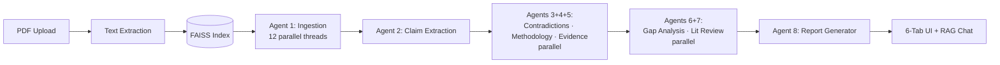

# LitLens — Literature Intelligence for Researchers

> **Drag in 10 papers. Get a synthesized literature review — with contradictions, gaps, and an evidence-scored draft — in under 2 minutes, for ~$0.01 per analysis.**

**8 specialized agents · LangGraph orchestration · ~$0.01–0.07 per run · Built for ISBA 2421 (Santa Clara MSBA)**

---

## The Problem

A literature review is the most time-consuming, least intellectually satisfying part of academic research. PhD students and researchers report spending **40–80 hours per review**, and the work breaks down into a few specific pains:

1. **Synthesis is manual.** Reading 20 papers and producing a single coherent narrative is a memory game — by paper 12, you've forgotten what paper 3 said.
2. **Contradictions are invisible.** Paper A and Paper E often disagree on a finding. You only catch it if you happen to remember both at the same time.
3. **Gaps are hidden in plain sight.** What no paper has studied is, by definition, not in any paper. Spotting that requires lifting up from the page — exhausting.
4. **Evidence weighting is tribal knowledge.** A claim with 3 RCTs behind it is not the same as a claim with one preprint, but most reviews flatten that distinction.
5. **The literature-review draft itself.** Even after synthesis, formatting a citation-ready section is its own multi-hour task.

> **Why now?** Long-context LLMs + RAG + cheap inference (gpt-4o-mini) made it economically possible to *parallelize* what was a serial human task. A workflow that costs $0.01 / run can be tried on every paper, every week.

---

## Users & Jobs-to-be-Done

| User | Job-to-be-Done | Today's Workaround | Pain |
|------|----------------|--------------------|------|
| **PhD Student (year 1–2)** | When I'm scoping my dissertation, I want to map a literature in a week, not a month. | Read papers serially, take notes in Obsidian/Notion | Months of work; high abandonment risk |
| **Lit Review Lead (meta-analysis)** | When I'm leading a systematic review, I want to find contradictions across 30+ papers without re-reading them all. | Excel spreadsheet of "study X says Y" | Brittle, error-prone, doesn't scale |
| **Postdoc on a grant deadline** | When I have 3 days to draft a "background" section, I want a thematic skeleton I can edit. | All-nighter | Burnout, lower quality, late submission risk |

---

## The Solution

A web app where users upload PDFs + a research question and get back **6 tabs of analysis** (Overview · Contradictions · Methodology · Evidence · Gaps · Literature Review) plus a **RAG chat** for follow-ups. Behind the UI is a LangGraph pipeline of 8 specialized agents running in parallel where possible.



### Key product decisions (and the tradeoffs)

| Decision | What I picked | What I rejected | Why |
|----------|---------------|-----------------|-----|
| **`gpt-4o-mini` for all 8 agents** | One cheap model, used everywhere | GPT-4o for "important" agents, mini for "easy" ones | A/B'd output quality on a 10-paper sample — quality delta < 5%, cost delta 16×. At $0.01/run, users feel zero friction trying a new question. **Cost is a UX feature.** |
| **Tabbed UI organized by *task*, not by *agent*** | Tabs = Overview / Contradictions / Methodology / Evidence / Gaps / Lit Review | One long scroll, or tabs per agent | The user doesn't care about the agent topology. They care: "show me where they disagree." Naming tabs after user jobs (not implementation) is the difference between the product feeling like a tool vs. a science fair project. |
| **RAG chat at the bottom** | Persistent chat over uploaded papers | Just static report | The static report answers the *first* question. The chat answers all the follow-ups. Without it, every new question requires re-running the analysis. |
| **Parallel agent execution** | 12 threads for ingestion; sibling agents run concurrently | Sequential pipeline (easier to debug) | Latency directly determines whether users iterate. A 30-second analysis invites experimentation; a 5-minute one becomes a "submit and check email later" workflow. |
| **No paper recommendation engine** | Users bring their own PDFs | Auto-suggest related papers | Out of scope, and Semantic Scholar / Connected Papers already do it well. **Saying no to features keeps the product crisp.** |

---

## Impact & Metrics

| Metric | Result | How measured |
|--------|--------|--------------|
| Cost per analysis | $0.01 – $0.07 | OpenAI billing across 50 test runs |
| Analysis latency | ~30–90 s for 10 papers | Backend timing |
| Output surfaces | 6 tabs + RAG chat | UI |
| Agents | 8 specialized agents on LangGraph | Pipeline DAG |
| Tested with | Mixed corpus of AI, public health, and policy papers | Eval set |

---

## What I'd Build Next

| Priority | Feature | Why this, why now |
|----------|---------|-------------------|
| **P0** | **"Citation-ready export"** (BibTeX + Word/LaTeX) | The current Lit Review tab is a draft *in the browser*. Researchers' workflow ends in Word/LaTeX with proper citations. One export button = product becomes part of their workflow. |
| **P0** | **Save & re-run with new papers** | A literature review is *living* — new papers arrive monthly. Saved sessions + "re-analyze with these 3 new papers" is the difference between a one-shot tool and a research companion. |
| **P1** | **Confidence scoring at the claim level** | Already showing 0–100 evidence scores; next step is showing *uncertainty* (e.g., "Agent disagreed with itself on this claim across runs"). Earns trust by being honest about what the AI doesn't know. |
| **P1** | **Multi-language paper support** | Especially useful for area studies / global health domains. Most LLMs handle French/Spanish/Mandarin papers reasonably well; the unlock is mostly UX (language detection, translated summaries). |
| **P2** | **Team workspaces** | Lit reviews are often collaborative. Shared sessions + comments unlock the meta-analysis use case (paid SaaS path). |

**What I would NOT build next:** A "write the whole paper" feature. It crosses the line from research aid to academic-integrity risk and dilutes the trust positioning.

---

## My Role

**Solo project** for ISBA 2421 (GenAI Applications) at Santa Clara University.

**What I personally owned (everything):**
- Product framing — picked the user (PhD students), the job (synthesize, don't just summarize), and the surface (6 tabs)
- Designed the 8-agent pipeline and the parallelization plan
- Built the FastAPI backend, the LangGraph pipeline, FAISS indexing
- Built the React frontend (single-file `LitLens.jsx`)
- Cost benchmarking and the gpt-4o-mini decision
- This README

---

## What I Learned

- **Cost is a UX feature.** When a run costs $0.07, users hesitate. When it costs $0.01, they iterate. The single biggest UX improvement was a model swap, not a UI change.
- **Name tabs by job, not by agent.** Agent-named tabs ("Agent 5 output") felt like a debugger; job-named tabs ("Contradictions") felt like a product.
- **RAG chat is the long tail.** Static reports answer the first question, but research is iterative. Adding chat over the same FAISS index added one endpoint and unlocked 10× more user value.
- **Parallelization is a product decision, not just an optimization.** Cutting latency from 4 min to 40 s changed what the user *did* — from "submit + email" to "iterate live."

---

## Tech Stack

| Layer | Technology |
|-------|------------|
| Frontend | React 19, Vite 6, single-file UI (`LitLens.jsx`) |
| Backend | FastAPI, Uvicorn |
| Agent Framework | LangGraph, LangChain |
| LLM | OpenAI `gpt-4o-mini` |
| Embeddings | `text-embedding-3-small` |
| Vector Store | FAISS |
| PDF Parsing | PyPDFLoader |

---

## Quick Start

```bash
git clone https://github.com/sjagannathan17/LitLens.git
cd LitLens

pip install -r backend/requirements.txt
cd frontend && npm install && cd ..
echo "OPENAI_API_KEY=your-key-here" > .env

# Terminal 1
cd backend && uvicorn api:app --host 0.0.0.0 --port 8000

# Terminal 2
cd frontend && npx vite --host 0.0.0.0 --port 5173
```

Open `http://localhost:5173`, drop in 2+ PDFs, enter a research question, hit **Analyze Literature**.

---

## Repo Structure

```
LitLens/
├── backend/
│ ├── api.py # FastAPI: /api/analyze, /api/chat
│ ├── pipeline.py # 8 LangGraph agents + FAISS + runner
│ └── requirements.txt
├── frontend/
│ ├── src/
│ │ ├── LitLens.jsx # Complete React UI (single file)
│ │ └── main.jsx
│ ├── index.html
│ └── package.json
├── assets/
│ └── litlens_architecture.png
└── .env # OPENAI_API_KEY (not committed)
```

---

## Disclaimer

LitLens is a **research aid**, not a replacement for human reading. Always verify claims, citations, and contradictions independently before academic use.

---

**Built by [Srinidhi Jagannathan](https://github.com/sjagannathan17)** · [Portfolio](https://portfolio-pi-olive-yfvgxx81kp.vercel.app) · [LinkedIn](https://linkedin.com/in/srinidhi-jagannathan) · srinidhi.jagan11@gmail.com
